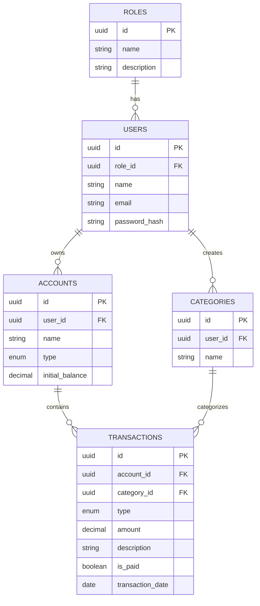

# 🗄️ Database Documentation

## 📁 Estrutura do Banco de Dados

### **Schema Overview**
- **Database**: `luis9046_controle_financeiro`
- **Engine**: MySQL 8.0+
- **Charset**: utf8mb4
- **Collation**: utf8mb4_unicode_ci
- **Primary Keys**: UUID (CHAR(36))

---

## 📊 **Entidades Principais**

### **👤 Users (Usuários)**
```sql
users {
  id: UUID PRIMARY KEY
  name: VARCHAR(100)
  email: VARCHAR(100) UNIQUE
  password_hash: VARCHAR(255)
  role_id: UUID FK → roles.id
  created_at: TIMESTAMP
  updated_at: TIMESTAMP
  deleted_at: TIMESTAMP NULL
}
```

### **🔐 Roles (Perfis)**
```sql
roles {
  id: UUID PRIMARY KEY
  name: VARCHAR(50) UNIQUE
  description: TEXT
  created_at: TIMESTAMP
  updated_at: TIMESTAMP
  deleted_at: TIMESTAMP NULL
}
```

### **💳 Accounts (Contas)**
```sql
accounts {
  id: UUID PRIMARY KEY
  user_id: UUID FK → users.id
  name: VARCHAR(100)
  type: ENUM('CORRENTE', 'POUPANCA', 'CARTAO_CREDITO', 'INVESTIMENTO')
  initial_balance: DECIMAL(15,2)
  created_at: TIMESTAMP
  updated_at: TIMESTAMP
  deleted_at: TIMESTAMP NULL
}
```

### **🏷️ Categories (Categorias)**
```sql
categories {
  id: UUID PRIMARY KEY
  user_id: UUID FK → users.id (NULL = global)
  name: VARCHAR(100)
  created_at: TIMESTAMP
  updated_at: TIMESTAMP
  deleted_at: TIMESTAMP NULL
}
```

### **💰 Transactions (Transações)**
```sql
transactions {
  id: UUID PRIMARY KEY
  account_id: UUID FK → accounts.id
  category_id: UUID FK → categories.id
  type: ENUM('RECEITA', 'DESPESA')
  amount: DECIMAL(15,2)
  description: TEXT
  is_paid: BOOLEAN DEFAULT FALSE
  transaction_date: DATE
  created_at: TIMESTAMP
  updated_at: TIMESTAMP
  deleted_at: TIMESTAMP NULL
}
```

---

## 🔗 **Relacionamentos**



---

## 🚀 **Como Usar**

### **1. Executar Migrations**
```bash
# Migration inicial
mysql -u usuario -p database_name < migrations/001_initial_schema.sql

# Seeds (dados iniciais)
mysql -u usuario -p database_name < seeds/001_roles_and_categories.sql
```

### **2. Reset Database (Development)**
```bash
# Limpar e recriar
mysql -u usuario -p -e "DROP DATABASE IF EXISTS luis9046_controle_financeiro;"
mysql -u usuario -p < migrations/001_initial_schema.sql
mysql -u usuario -p luis9046_controle_financeiro < seeds/001_roles_and_categories.sql
```

---

## 📝 **Migration Pattern**

### **Nomenclatura**
- `001_initial_schema.sql` - Schema inicial
- `002_add_user_avatar.sql` - Adicionar campo avatar
- `003_create_budgets_table.sql` - Nova tabela orçamentos

### **Estrutura de Migration**
```sql
-- ========================================
-- MIGRATION: 002_add_user_avatar
-- DESCRIPTION: Adiciona campo avatar para usuários
-- DATE: 2025-08-12
-- ========================================

USE luis9046_controle_financeiro;

-- Up migration
ALTER TABLE users ADD COLUMN avatar_url VARCHAR(255) NULL AFTER email;

-- Down migration (comentado para referência)
-- ALTER TABLE users DROP COLUMN avatar_url;
```

---

## 🔧 **Manutenção**

### **Backup**
```bash
# Backup completo
mysqldump -u usuario -p luis9046_controle_financeiro > backup_$(date +%Y%m%d_%H%M%S).sql

# Backup apenas estrutura
mysqldump -u usuario -p --no-data luis9046_controle_financeiro > structure_backup.sql
```

### **Índices Importantes**
```sql
-- Performance essencial
CREATE INDEX idx_transactions_account_date ON transactions(account_id, transaction_date);
CREATE INDEX idx_transactions_user_type ON transactions(account_id, type);
CREATE INDEX idx_accounts_user ON accounts(user_id);
CREATE INDEX idx_categories_user ON categories(user_id);
```

---

## 📊 **Estatísticas**

| Tabela | Estimativa de Registros | Índices | Relacionamentos |
|--------|------------------------|---------|-----------------|
| `roles` | ~5 | 1 PK | → users |
| `users` | 1K-10K | 2 (PK, email) | roles → accounts, categories |
| `accounts` | 5K-50K | 2 (PK, user_id) | users → transactions |
| `categories` | 100-1K | 2 (PK, user_id) | users → transactions |
| `transactions` | 100K-1M+ | 4 (PK, account, date, type) | accounts, categories |

---

## ⚡ **Performance Tips**

1. **Particionamento**: Considerar particionamento de `transactions` por data
2. **Índices Compostos**: Usar índices compostos para queries frequentes
3. **Soft Delete**: Usar `deleted_at` para preservar histórico
4. **UUID vs Auto-increment**: UUIDs garantem unicidade em sistemas distribuídos
5. **Connection Pooling**: Configurar pool de conexões no backend
